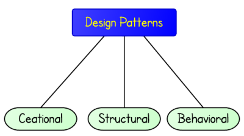

# Design Patterns in Golang
How to implement design patterns in Go?



## Running

```bash
$ go run .
```
## Testing

```bash
$ go test ./... -v --cover
```

## Coverage

```bash
$ go test ./... -v --cover -coverprofile cover.out
$ go tool cover -html=cover.out -o cover.html
```

## Related article

[Áp dụng design patterns với Go](https://cuibap.xyz/go/design-patterns-in-golang/)
